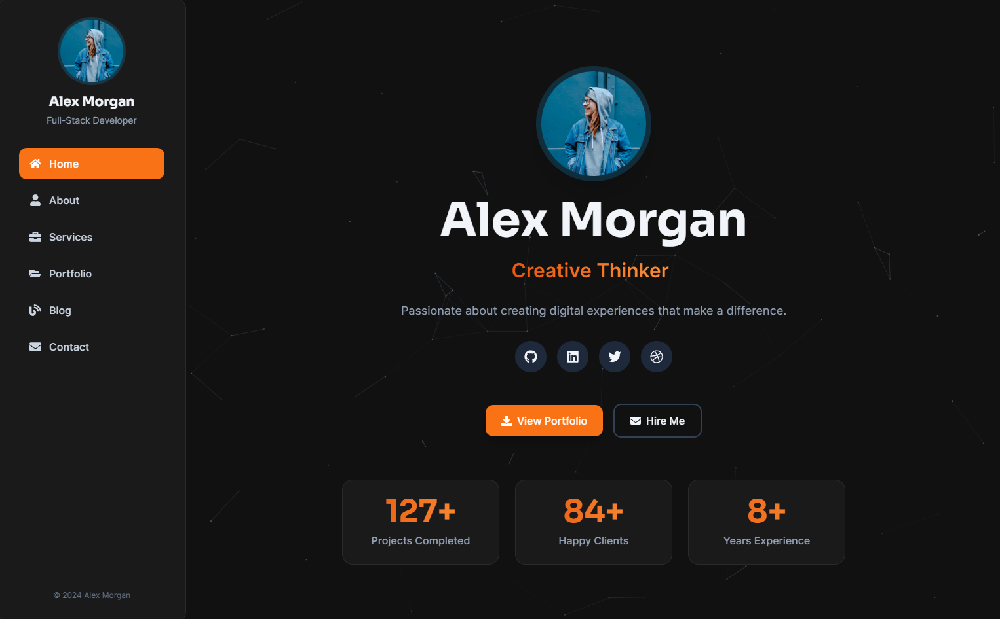

# Pulse - Modern One-Page Portfolio & vCard Template



A professional, ThemeForest-ready portfolio and vCard template built with React 19, Vite 7, and Tailwind CSS 3.4. Features a smooth single-page experience with dedicated detail pages for services, portfolio items, and blog articles.

**Live Demo:** [https://pulseshiphrah.netlify.app/](https://pulseshiphrah.netlify.app/)

[](https://reactjs.org/)
[](https://vitejs.dev/)
[](https://tailwindcss.com/)
[](LICENSE.txt)

## Features

### Core Features
- ✨ **Modern Tech Stack**: React 19.2.0, Vite 7.2.4, Tailwind CSS 3.4.19
- 🎨 **Light/Dark Theme**: Toggle with localStorage persistence and OS preference detection
- 🎨 **8 Color Schemes**: Choose from Blue, Purple, Green, Orange, Pink, Red, Teal, and Yellow
- ✨ **Particle Background**: Performance-optimized animated particle effects with singleton pattern
- ⚙️ **Configuration Panel**: Real-time customization of particles and color schemes
- 📱 **Fully Responsive**: Mobile-first design with adaptive navigation
- ⚡ **Performance Optimized**: Production build only 145KB gzipped
- ♿ **Accessible**: WCAG 2.1 compliant with keyboard navigation and ARIA labels
- 🔍 **SEO Ready**: Complete meta tags, Open Graph, Twitter Cards
- 🎭 **Smooth Animations**: CSS animations with reduced-motion support
- 🧹 **Clean Code**: Zero ESLint errors or warnings

### Sections
1. **Home** - Hero section with typer effect, social links, and metrics
2. **About** - Biography, skills bars, timeline (experience & education), testimonials slider
3. **Services** - Service cards with detail pages
4. **Portfolio** - Filterable project gallery with detail pages
5. **Blog** - Filterable article cards with dedicated article pages
6. **Contact** - Contact form with validation and contact information

### Additional Features
- 🎯 **Scrollspy Navigation**: Active section highlighting
- 🔄 **Smooth Scrolling**: Native smooth scroll with IntersectionObserver
- 📝 **Form Validation**: Client-side validation with helpful error messages
- 🎨 **Typer Effect**: Animated role/title display
- 🎠 **Testimonials Slider**: Keyboard-accessible carousel
- 🏷️ **Category Filtering**: For portfolio and blog sections
- 📱 **Mobile Menu**: Slide-out drawer navigation
- ⏳ **Preloader**: With timeout failsafe and reduced-motion support
- ✨ **Particle Animations**: 160 particles with optimized rendering using @tsparticles
- 🎛️ **Settings Panel**: Toggle particles and switch color schemes on the fly

## Installation

### Prerequisites
- Node.js 18+ and npm/yarn
- Modern web browser (Chrome, Firefox, Safari, Edge)

### Quick Start

1. **Clone or download the template**
   ```bash
   # If using git
   git clone <your-repo-url>
   cd pulse
   ```

2. **Install dependencies**
   ```bash
   npm install
   ```

3. **Start development server**
   ```bash
   npm run dev
   ```
   The site will be available at `http://localhost:5173`

4. **Build for production**
   ```bash
   npm run build
   ```
   Production files will be in the `dist` folder.

5. **Preview production build**
   ```bash
   npm run preview
   ```

## Configuration

### 1. Personal Information

Edit [src/data/data.js](src/data/data.js) to customize your information:

```javascript
export const personalInfo = {
  name: 'Your Name',
  role: ['Role 1', 'Role 2', 'Role 3'], // Typer effect strings
  bio: 'Your bio text',
  email: 'your@email.com',
  phone: '+1 (555) 123-4567',
  location: 'Your City, Country',
  avatar: 'path/to/your/image.jpg',
  socials: [
    { name: 'GitHub', url: 'https://github.com/yourusername', icon: 'FaGithub' },
    // Add more social links
  ],
  metrics: [
    { label: 'Projects Completed', value: 100 },
    { label: 'Happy Clients', value: 50 },
    { label: 'Years Experience', value: 5 },
  ],
};
```

### 2. About Section

Update skills, experience, and education:

```javascript
export const aboutData = {
  description: 'Your about text...',
  skills: [
    { name: 'Skill Name', level: 90 }, // Level is 0-100
  ],
  experience: [
    {
      id: 1,
      type: 'work', // or 'education'
      title: 'Job Title',
      organization: 'Company Name',
      period: '2020 - Present',
      description: 'Job description...',
    },
  ],
};
```

### 3. Testimonials

Add or modify client testimonials:

```javascript
export const testimonials = [
  {
    id: 1,
    name: 'Client Name',
    role: 'Client Title',
    avatar: 'path/to/avatar.jpg',
    rating: 5,
    text: 'Testimonial text...',
  },
];
```

### 4. Services

Add your services:

```javascript
export const services = [
  {
    id: 'unique-service-id',
    title: 'Service Name',
    icon: 'FaIcon', // Font Awesome icon name
    description: 'Short description',
    fullDescription: 'Detailed description for service page',
    features: ['Feature 1', 'Feature 2'],
    technologies: ['Tech 1', 'Tech 2'],
    image: 'path/to/service-image.jpg',
  },
];
```

### 5. Portfolio

Add your projects:

```javascript
export const portfolio = [
  {
    id: 'unique-project-id',
    title: 'Project Name',
    category: 'Web Application', // Must match categories
    thumbnail: 'path/to/thumbnail.jpg',
    description: 'Short description',
    client: 'Client Name',
    year: '2024',
    technologies: ['React', 'Node.js'],
    images: ['image1.jpg', 'image2.jpg'],
    overview: 'Detailed project overview',
    challenges: ['Challenge 1', 'Challenge 2'],
    results: ['Result 1', 'Result 2'],
    link: 'https://project-url.com',
  },
];
```

### 6. Blog Posts

Add articles:

```javascript
export const blogPosts = [
  {
    id: 'unique-post-id',
    title: 'Article Title',
    category: 'Web Development',
    date: '2024-01-15',
    excerpt: 'Short excerpt...',
    image: 'path/to/article-image.jpg',
    readTime: '5 min read',
    content: `
# Article Title

Your article content in markdown-like format...
    `,
  },
];
```

### 7. Categories

Update filter categories:

```javascript
export const categories = {
  portfolio: ['All', 'Web Application', 'Mobile App', 'Design'],
  blog: ['All', 'Web Development', 'Design', 'Backend'],
};
```

## Customization

### Color Schemes

The template includes 8 pre-configured color schemes that users can switch between using the configuration panel. To add or modify color schemes, edit [src/context/ColorContext.jsx](src/context/ColorContext.jsx):

```javascript
export const colorSchemes = {
  yourColor: {
    name: 'Your Color',
    primary: '#hexcode',
    primaryHover: '#hexcode',
    gradient: 'linear-gradient(to right, #hexcode, #hexcode)',
  },
};
```

Available color schemes:
- Blue (default)
- Purple
- Green
- Orange
- Pink
- Red
- Teal
- Yellow

### Theme Colors

Edit [tailwind.config.js](tailwind.config.js) to change base theme colors:

```javascript
colors: {
  primary: {
    // Your color palette
    500: '#0ea5e9',
    600: '#0284c7',
    // ...
  },
  'dark-bg': '#111111',
  'dark-card': '#1a1a1a',
}
```

### Particle Background

Customize particle settings in [src/components/ParticleBackground.jsx](src/components/ParticleBackground.jsx):

```javascript
particles: {
  number: {
    value: 160 // Number of particles
  },
  size: {
    value: { min: 0.4, max: 1.2 } // Particle size
  },
  links: {
    distance: 100, // Connection distance
    opacity: 0.45, // Link opacity
  }
}
```

Users can also toggle particles on/off using the configuration panel.

### Fonts

Fonts are loaded via Google Fonts in [src/index.css](src/index.css). To change:

1. Update the `@import` URL
2. Update `tailwind.config.js` font families

### Icons

The template uses React Icons (Font Awesome). Available icon names:
- Check [React Icons](https://react-icons.github.io/react-icons/) for all options
- Update icon names in data.js (e.g., 'FaCode', 'FaGithub')

### Contact Form

By default, the form uses `mailto:`. To use a custom endpoint:

Edit [src/components/sections/ContactSection.jsx](src/components/sections/ContactSection.jsx):

```javascript
const handleSubmit = async (e) => {
  e.preventDefault();
  if (!validateForm()) return;

  try {
    const response = await fetch('YOUR_API_ENDPOINT', {
      method: 'POST',
      headers: { 'Content-Type': 'application/json' },
      body: JSON.stringify(formData),
    });

    if (response.ok) {
      setStatus('success');
      setFormData({ name: '', email: '', service: '', message: '' });
    } else {
      setStatus('error');
    }
  } catch (error) {
    setStatus('error');
  }
};
```

## SEO Configuration

Update meta tags in [index.html](index.html) for global SEO settings:

```html
<meta name="description" content="Your site description" />
<meta name="keywords" content="your, keywords, here" />
<meta property="og:title" content="Your Site Title" />
<meta property="og:description" content="Your site description" />
```

Page-specific titles and meta descriptions are set dynamically in component files using `document.title` and `querySelector('meta[name="description"]')`.

## Deployment

### Static Hosting (Netlify, Vercel, GitHub Pages)

1. Build the project:
   ```bash
   npm run build
   ```

2. Deploy the `dist` folder to your hosting provider

### Netlify

1. Connect your Git repository
2. Build command: `npm run build`
3. Publish directory: `dist`

### Vercel

1. Import your Git repository
2. Vercel auto-detects Vite settings
3. Deploy

### GitHub Pages

1. Install gh-pages:
   ```bash
   npm install -D gh-pages
   ```

2. Add to package.json:
   ```json
   "scripts": {
     "predeploy": "npm run build",
     "deploy": "gh-pages -d dist"
   }
   ```

3. Update `vite.config.js`:
   ```javascript
   export default defineConfig({
     base: '/your-repo-name/',
     // ...
   });
   ```

4. Deploy:
   ```bash
   npm run deploy
   ```

## Browser Support

- ✅ Chrome (latest)
- ✅ Firefox (latest)
- ✅ Safari (latest)
- ✅ Edge (latest)
- ✅ Opera (latest)
- ✅ Modern mobile browsers (iOS Safari, Chrome Mobile)
- ❌ Internet Explorer (not supported - React 19 requirement)

## Performance

The template is highly optimized for performance:
- **Small Bundle Size**: 469KB JavaScript (145KB gzipped)
- **Optimized CSS**: 26KB CSS (5.5KB gzipped)
- **Lazy Loading**: Images and components load on demand
- **Code Splitting**: React Router lazy loading for optimal performance
- **Singleton Pattern**: Only one particle instance active at a time
- **Optimized Tailwind**: Unused styles automatically purged
- **Minified Builds**: Production builds fully minified and optimized
- **Preload Critical Resources**: Fonts and assets preloaded for fast initial render

## Accessibility

- Semantic HTML5 elements
- ARIA labels and roles
- Keyboard navigation support
- Focus management
- Screen reader friendly
- Reduced motion support

## Project Structure

```
pulse/
├── public/              # Static assets
├── src/
│   ├── components/      # Reusable components
│   │   ├── sections/    # Page sections
│   │   │   ├── HomeSection.jsx
│   │   │   ├── AboutSection.jsx
│   │   │   ├── ServicesSection.jsx
│   │   │   ├── PortfolioSection.jsx
│   │   │   ├── BlogSection.jsx
│   │   │   └── ContactSection.jsx
│   │   ├── Sidebar.jsx
│   │   ├── ConfigPanel.jsx
│   │   ├── ParticleBackground.jsx
│   │   └── Preloader.jsx
│   ├── context/         # React Context providers
│   │   ├── ThemeContext.jsx
│   │   ├── ColorContext.jsx
│   │   └── ConfigContext.jsx
│   ├── data/            # Configuration and content data
│   │   └── data.js
│   ├── hooks/           # Custom React hooks
│   │   ├── useTyper.js
│   │   └── useCounter.js
│   ├── pages/           # Page components
│   │   ├── Home.jsx
│   │   ├── Details.jsx
│   │   └── BlogArticle.jsx
│   ├── App.jsx          # Main app component
│   ├── main.jsx         # Entry point
│   └── index.css        # Global styles
├── index.html
├── tailwind.config.js
├── vite.config.js
└── package.json
```

## License

This template is licensed for use on ThemeForest. See LICENSE file for details.

## Support

For support inquiries:
- **ThemeForest Support Tab**: For item support (include your purchase code)
- **Documentation**: Comprehensive guides included (10 files)
- **Live Demo**: [https://pulseshiphrah.netlify.app/](https://pulseshiphrah.netlify.app/)

## Credits

- **Built with**: React, Vite, Tailwind CSS
- **Icons**: React Icons (Font Awesome)
- **Fonts**: Inter, Sora (Google Fonts)
- **Particles**: @tsparticles/react, @tsparticles/slim
- **Images**: Unsplash (demo images - replace with your own)

## Changelog

### Version 1.0.2 (2025-12-15)
- **FIXED**: All ESLint errors and warnings (11 issues resolved)
- **FIXED**: React Hooks purity violations in ParticleBackground component
- **FIXED**: Ref cleanup warnings in AboutSection and HomeSection
- **FIXED**: setState-in-effect violations in Preloader and custom hooks
- **FIXED**: Fast refresh violations in Context files
- **IMPROVED**: Code quality with proper React best practices
- **IMPROVED**: Removed unused code and dependencies for cleaner codebase
- **OPTIMIZED**: Removed framer-motion dependency (~500KB bundle size reduction)
- **OPTIMIZED**: Favicon configuration for better browser compatibility
- **REMOVED**: Unused components (SEO.jsx, ColorSwitcher.jsx, App.css)
- **REMOVED**: Unused CSS classes
- **UPDATED**: Profile picture to professional image
- **UPDATED**: Package.json with proper version and metadata

### Version 1.0.1 (2025-12-14)
- Added animated particle background with performance optimization
- Added configuration panel for real-time customization
- Added 8 color scheme options (Blue, Purple, Green, Orange, Pink, Red, Teal, Yellow)
- Implemented singleton pattern for particle rendering
- Added particle toggle functionality
- Enhanced performance with Intersection Observer for particle activation
- Fixed portfolio filter clickability
- Fixed navigation from detail pages to scroll to correct sections
- Fixed z-index stacking issues for clickable elements
- Updated project structure with new context providers

### Version 1.0.0 (2025-01-15)
- Initial release
- Single-page portfolio with 6 sections
- Service and portfolio detail pages
- Blog article pages
- Light/Dark theme
- Responsive design
- SEO optimization
- Accessibility features

---

Made with ❤️ for ThemeForest
